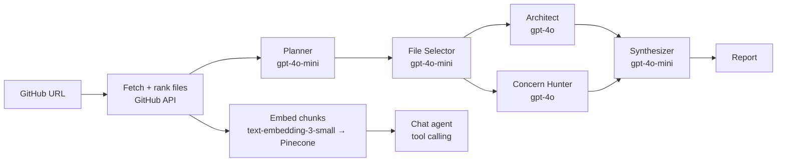

# RepoMind

Multi-agent analysis for GitHub repositories. Paste a repo URL and a LangGraph pipeline of specialist agents reads the code, maps the architecture, flags risks, and streams each step to a live UI. Then you can chat with the codebase: a tool-calling agent retrieves code with Pinecone RAG, reads files and greps.

**Live demo:** https://repomind.yusufhussain.in

---

## How it works



**Analysis:**
1. **Fetch.** The GitHub tree is filtered to source and text files, then ranked. Manifests and READMEs come first, then shallow `src/`, `app/` and `lib/` paths, with tests last.
2. **Agents.** The **Planner** decides what matters and the **File Selector** picks the files to read. The **Architect** and **Concern Hunter** then run in parallel, and the **Synthesizer** merges their output into one report.
3. **Model routing.** Cheap models handle planning, selection and synthesis. `gpt-4o` is used only for the two steps that need deep reasoning.
4. **Embedding.** Files are chunked (3,200 chars with 400 overlap), embedded, and upserted to Pinecone for retrieval.

**Chat:** The chat agent gets a file manifest instead of the whole repo. It calls tools to fetch only what it needs:

| Tool | What it does |
|---|---|
| `search_code` | Semantic top-K retrieval from Pinecone |
| `read_file` | Read one indexed file |
| `list_directory` | Browse the indexed tree |
| `grep` | Regex search across indexed files |

Tool calls are capped at 5 iterations per turn. Each call streams to the UI as a card showing its arguments, a result preview and its duration.

**Execution:** Analysis runs as a BullMQ job when a worker is online, with events relayed to the browser over Redis pub/sub and SSE. Without a worker, the same pipeline runs inline in the request, which is how the serverless deployment works.

---

## Cost controls (public demo)

Every request to the live demo spends real OpenAI credit, so these guardrails are built in:

- **Owner-only analysis.** When `DEMO_ACCESS_KEY` is set, visitors can chat with repos that are already analyzed, but only the owner can add repos or start analysis. The key is checked in constant time and swapped for an HttpOnly cookie that holds a hash, never the key. Unlock attempts are rate-limited.
- **Per-IP chat limit** (default 15 questions/hour) plus a **global daily cap** (default 300). Both are fixed-window counters in Redis that **fail closed**: if Redis is unreachable, requests are refused, not let through for free.
- **Bounded input.** Only the last 12 messages are sent, each truncated to 4,000 chars. Output is capped at 1,500 tokens per answer for anonymous visitors.
- **Fetch caps.** Up to 60 files per repo, 60 KB per file and 600 KB total.
- **Private chat memory.** Each browser gets its own conversation (anonymous cookie id, last 20 turns, 7-day TTL), so visitors never see each other's chats.

---

## Stack

Next.js 16 (App Router, SSE streaming) · TypeScript · LangGraph · OpenAI function calling · Pinecone · Redis (ioredis) · BullMQ · Tailwind CSS

## Project layout

```
app/api/repos/…          REST + SSE routes: create, analyze (stream), chat (stream), history
app/api/access           owner unlock for demo mode
lib/agents/              LangGraph graph, agent prompts, streaming tool-call loop
lib/tools/               chat tools (search_code, read_file, list_directory, grep)
lib/analyze.ts           fetch → agents → embed pipeline (shared by worker + inline path)
lib/queue.ts, worker.ts  BullMQ queue, pub/sub event relay, standalone worker
lib/embed.ts             chunking + Pinecone upsert/query
lib/store.ts             repo metadata + indexed context in Redis
lib/ratelimit.ts         fail-closed fixed-window limiter
scripts/seed.ts          pre-analyze demo repos
```

---

## Run locally

```bash
cp .env.example .env.local     # add OPENAI_API_KEY (Pinecone + GitHub token optional)
npm install
npm run infra:up               # Redis on :6380 via docker compose
npm run dev                    # http://localhost:3000
npm run worker                 # optional: queue mode instead of inline
```

Leave `DEMO_ACCESS_KEY` unset locally so everything stays open.

## Deploy

1. Create a cloud Redis (e.g. Upstash) and set `REDIS_URL=rediss://…`.
2. Set `OPENAI_API_KEY`, `PINECONE_API_KEY`, `GITHUB_TOKEN`, `DEMO_ACCESS_KEY`, and optionally `OPENAI_MODEL=gpt-4o-mini` for cheaper chat.
3. Deploy to Vercel. No worker is needed, because analysis runs inline.
4. Pre-analyze demo repos into the same Redis: `npm run seed -- https://github.com/owner/repo`.

## Limitations

- Large repos are sampled, not fully indexed, because of the fetch caps above. Analysis of a monorepo covers its highest-ranked 60 files.
- Only public repositories are supported.
- There is no evaluation suite yet, so report quality hasn't been measured against a benchmark.
